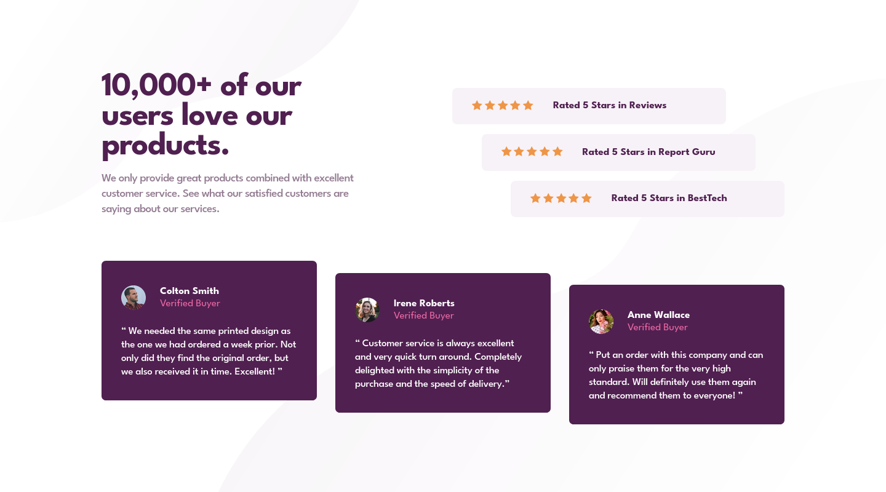

# Frontend Mentor - Social proof section solution

This is a solution to the [Social proof section challenge on Frontend Mentor](https://www.frontendmentor.io/challenges/social-proof-section-6e0qTv_bA). Frontend Mentor challenges help you improve your coding skills by building realistic projects. 

## Overview

### The challenge

Users should be able to:

- View the optimal layout depending on their device's screen size
- See hover states for interactive elements

### Solution Screenshot

### Links

- Live Site URL: 

## My process

### Built with

- HTML/CSS
- CSS variables
- Modular CSS

### Self reflection 

In this project, I tried to build a layout using modular CSS for the first time. It got messy, but I've learned from it and know what to do differently next time. Next time I'll try to declare the media queries right below the rule set it needs to override to prevent confusion using ems. Also, I gave the modules a margin which made them location dependent and, changed the root font size to 15px. Next time I'll leave it at 16px to reduce confusion and unnecessary long relative units. As for the modifiers, I had to put them with the modules instead of separately. 

## Author

- Frontend Mentor - [@justinvanre](https://www.frontendmentor.io/profile/justinvanre)
